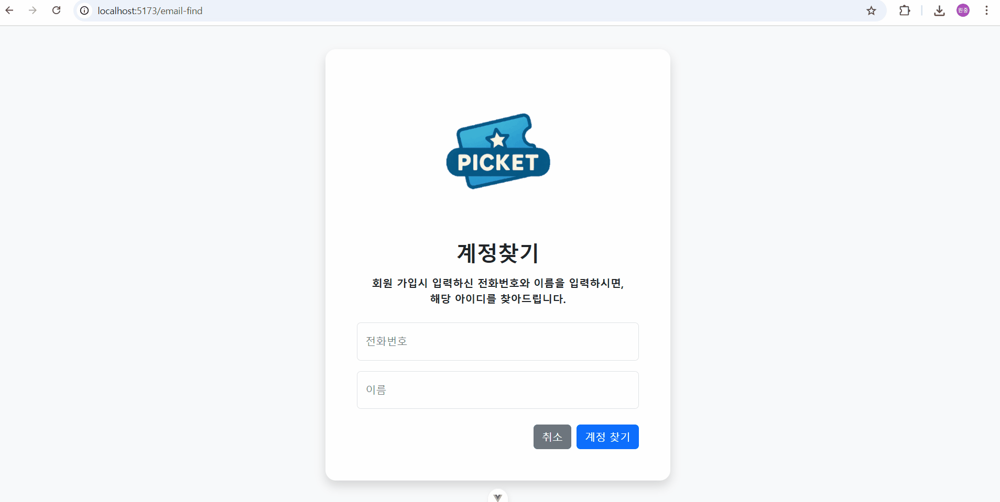
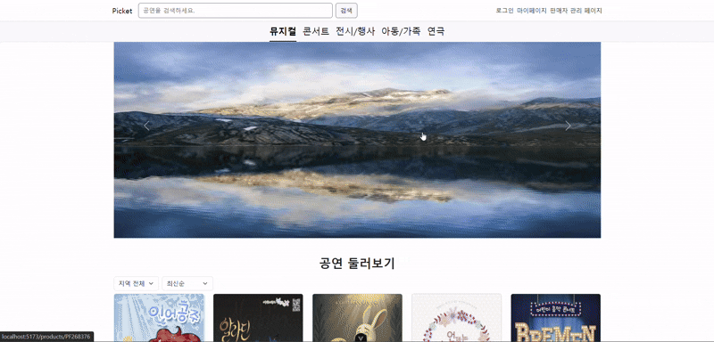
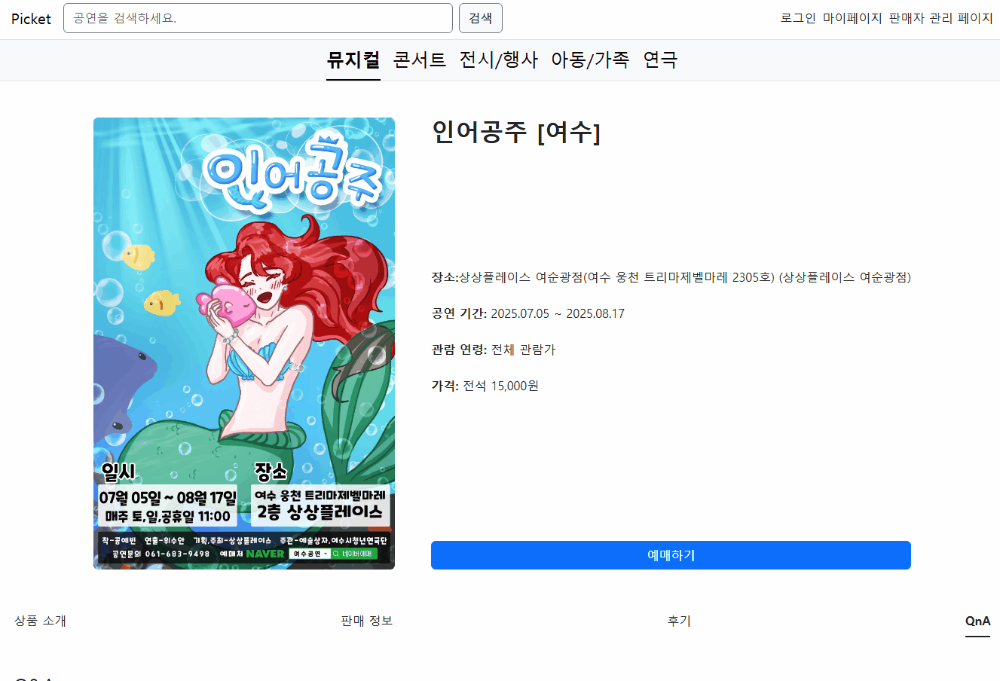

<h1 align="center">🎟️ Picket - Frontend Project</h1>

  
  
<h3 align="center">1팀 - Picketnologia</h3>

  

# 👨‍💻 팀원 구성

<table align="center">
  <tr>
  
  

  </tr>
  <tr>
    <td align="center">
      <b>최경민</b> 
    </td>
    <td align="center">
      <b>강설</b> 
    </td>
    <td align="center">
      <b>김원중</b> 
    </td>
    <td align="center">
      <b>이상우</b> 
    </td>
    <td align="center">
      <b>김광호</b> 
    </td>
  </tr>
</table>
  

# 프로젝트 주소

[www.picket.o-r.kr](https://www.picket.o-r.kr)

# 피그마 주소

[figma 주소](https://www.figma.com/design/Eahp7OBGzdPdH786uO95Cv/%EC%BB%B4%ED%8F%AC%EB%84%8C%ED%8A%B8-%EC%A0%95%EB%A6%AC?node-id=0-1&t=1yp74xPdMWkxE4xb-1)

# 프로젝트 시연

  
로그인

  

  
   
  

 

  
계정찾기

  

  
   
  

 

  
계정찾기

  

  
   
  

 

  
일반 회원가입

  

  
   
  

 

  
판매자 회원가입

  

  
   
  

 

  
판매자 관리 페이지

  

  
   
  

 

  
마이 페이지

  

  
   
  

 

  
상세페이지

  

  
   
  

 

  
예매하기

  

  
   
  

 